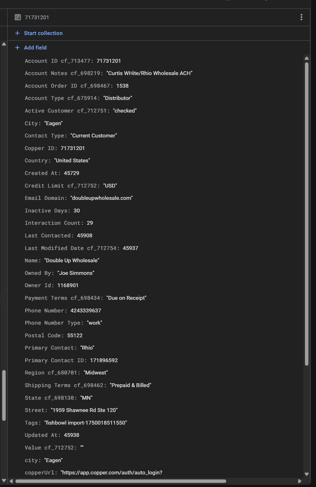

# Monthly Commission System - Implementation Spec

## Data Sources & Field Mappings

### 1. Customer Segment Detection

**Source:** `copper_companies` collection**Field:** `Account Type cf_675914`**Values:**

- "Distributor" → Distribution segment
- "Wholesale" → Wholesale segment
- Other values → Default to Distribution

  

### 2. Sales Order Data

**Source:** `fishbowl_sales_orders` collection**Key Fields:**

- `salesPerson` - Fishbowl username (e.g., "BenW", "BrandonG")
- `customerId` - Links to Copper company
- `revenue` - Commission base amount
- `postingDate` - When order was processed (commission trigger)
- `commissionMonth` - "2024-05" format
- `commissionYear` - 2024
- `customerName` - Display name

### 3. Rep Transfer Detection

**Logic:** Query historical `fishbowl_sales_orders` for same `customerId`

- If `salesPerson` field changes between orders → Rep transfer occurred
- Example:
  - Order 1: customerId="7", salesPerson="BenW"
  - Order 2: customerId="7", salesPerson="BrandonG" ← Transfer detected!

### 4. Customer Status Calculation

**Logic:** Look at order history for the customer + current sales rep

```javascript
function getCustomerStatus(customerId, currentSalesPerson, orderDate) {
  // Get last order from THIS rep for THIS customer
  const lastOrder = getLastOrderForCustomerAndRep(customerId, currentSalesPerson, orderDate);
  
  if (!lastOrder) {
    // Check if customer ordered from DIFFERENT rep
    const lastOrderAnyRep = getLastOrderForCustomer(customerId, orderDate);
    if (lastOrderAnyRep && lastOrderAnyRep.salesPerson !== currentSalesPerson) {
      return "rep_transfer"; // Special case
    }
    return "new"; // Truly new customer
  }
  
  const monthsSinceLastOrder = getMonthsDiff(lastOrder.postingDate, orderDate);
  
  if (monthsSinceLastOrder >= 12) {
    return "new"; // Reverted to new
  } else if (monthsSinceLastOrder <= 6) {
    return "6month"; // Active
  } else {
    return "12month"; // Maintaining
  }
}
```

### 5. Commission Timing

**Trigger:** Order has `postingDate` field filled
**Payment Period:** Monthly (1st to end of month)
**Historical Data:** Start from January 1, 2024 for testing

---

## Firestore Collections

### Collection: `settings/commission_rates`

```javascript
{
  // Commission rate matrix
  rates: [
    {
      id: "ae_distributor_new",
      title: "Account Executive",
      segment: "Distributor",
      customerStatus: "new",
      commissionPercent: 8.0,
      active: true
    },
    {
      id: "ae_distributor_6mo",
      title: "Account Executive",
      segment: "Distributor",
      customerStatus: "6month",
      commissionPercent: 5.0,
      active: true
    },
    {
      id: "ae_distributor_12mo",
      title: "Account Executive",
      segment: "Distributor",
      customerStatus: "12month",
      commissionPercent: 3.0,
      active: true
    },
    {
      id: "ae_wholesale_new",
      title: "Account Executive",
      segment: "Wholesale",
      customerStatus: "new",
      commissionPercent: 10.0,
      active: true
    },
    {
      id: "ae_wholesale_6mo",
      title: "Account Executive",
      segment: "Wholesale",
      customerStatus: "6month",
      commissionPercent: 7.0,
      active: true
    },
    {
      id: "ae_wholesale_12mo",
      title: "Account Executive",
      segment: "Wholesale",
      customerStatus: "12month",
      commissionPercent: 5.0,
      active: true
    }
    // ... more for Jr. AE, Account Manager, etc.
  ],
  
  specialRules: {
    repTransfer: {
      enabled: true,
      flatFee: 500,
      percentFallback: 5.0,
      useGreater: true
    },
    inactivityThreshold: 12 // months
  },
  
  titles: [
    "Account Executive",
    "Jr. Account Executive",
    "Account Manager",
    "Sr. Account Executive"
  ],
  
  segments: [
    { id: "distributor", name: "Distributor" },
    { id: "wholesale", name: "Wholesale" }
  ]
}
```

### Collection: `monthly_commissions`

```javascript
{
  id: "BenW_2024-05_order_4255",
  repId: "user_firebase_uid", // From reps collection
  salesPerson: "BenW", // Fishbowl username
  repName: "Ben Wallner",
  repTitle: "Account Executive",
  
  // Order details
  orderId: "4255",
  orderNum: "#0P4HVY0BP30JP8",
  customerId: "7",
  customerName: "Shopify Customer",
  
  // Customer classification
  customerSegment: "Distributor",
  customerStatus: "new", // new, 6month, 12month, rep_transfer
  
  // Commission calculation
  orderRevenue: 72.00,
  commissionRate: 8.0,
  commissionAmount: 5.76,
  
  // Dates
  orderDate: Timestamp,
  postingDate: Timestamp,
  commissionMonth: "2024-05",
  commissionYear: 2024,
  
  // Metadata
  calculatedAt: Timestamp,
  paidStatus: "pending", // pending, paid, void
  notes: "New business - Distributor"
}
```

### Collection: `monthly_commission_summary`

```javascript
{
  id: "BenW_2024-05",
  repId: "user_firebase_uid",
  salesPerson: "BenW",
  repName: "Ben Wallner",
  
  month: "2024-05",
  year: 2024,
  
  // Totals
  totalOrders: 45,
  totalRevenue: 125000.00,
  totalCommission: 8750.00,
  
  // Breakdown by segment
  distributor: {
    orders: 30,
    revenue: 80000.00,
    commission: 5200.00
  },
  wholesale: {
    orders: 15,
    revenue: 45000.00,
    commission: 3550.00
  },
  
  // Breakdown by status
  new: {
    orders: 5,
    revenue: 15000.00,
    commission: 1200.00
  },
  sixMonth: {
    orders: 25,
    revenue: 75000.00,
    commission: 4500.00
  },
  twelveMonth: {
    orders: 15,
    revenue: 35000.00,
    commission: 3050.00
  },
  
  paidStatus: "pending",
  calculatedAt: Timestamp
}
```

---

## Calculation Algorithm

### Step 1: Process Sales Order

```javascript
async function processOrderCommission(order) {
  // 1. Get customer account type from Fishbowl (SOURCE OF TRUTH)
  const customer = await getCustomerFromFishbowl(order.customerId);
  const accountType = customer?.accountType || "Retail";
  
  // 2. Get rep details
  const rep = await getRepBySalesPerson(order.salesPerson);
  if (!rep || !rep.active) {
    console.log(`Rep ${order.salesPerson} not found or inactive`);
    return null;
  }
  
  // 3. Determine customer status
  const customerStatus = await getCustomerStatus(
    order.customerId,
    order.salesPerson,
    order.postingDate
  );
  
  // 4. Get commission rate
  const rate = await getCommissionRate(
    rep.title,
    segment,
    customerStatus
  );
  
  if (!rate) {
    console.log(`No rate found for ${rep.title}, ${segment}, ${customerStatus}`);
    return null;
  }
  
  // 5. Calculate commission
  let commissionAmount;
  if (customerStatus === "rep_transfer") {
    const specialRule = await getSpecialRule("repTransfer");
    const flatFee = specialRule.flatFee;
    const percentCommission = order.revenue * (specialRule.percentFallback / 100);
    commissionAmount = specialRule.useGreater 
      ? Math.max(flatFee, percentCommission)
      : flatFee;
  } else {
    commissionAmount = order.revenue * (rate.commissionPercent / 100);
  }
  
  // 6. Save commission record
  const commission = {
    id: `${order.salesPerson}_${order.commissionMonth}_order_${order.salesOrderId}`,
    repId: rep.id,
    salesPerson: order.salesPerson,
    repName: rep.name,
    repTitle: rep.title,
  
    orderId: order.salesOrderId,
    orderNum: order.num,
    customerId: order.customerId,
    customerName: order.customerName,
  
    customerSegment: segment,
    customerStatus: customerStatus,
  
    orderRevenue: order.revenue,
    commissionRate: rate.commissionPercent,
    commissionAmount: commissionAmount,
  
    orderDate: order.postingDate,
    postingDate: order.postingDate,
    commissionMonth: order.commissionMonth,
    commissionYear: order.commissionYear,
  
    calculatedAt: new Date(),
    paidStatus: "pending",
    notes: `${customerStatus} - ${segment}`
  };
  
  await saveCommission(commission);
  return commission;
}
```

### Step 2: Get Customer Status

```javascript
async function getCustomerStatus(customerId, currentSalesPerson, orderDate) {
  // Get all orders for this customer before this order
  const previousOrders = await db.collection('fishbowl_sales_orders')
    .where('customerId', '==', customerId)
    .where('postingDate', '<', orderDate)
    .orderBy('postingDate', 'desc')
    .get();
  
  if (previousOrders.empty) {
    return "new"; // First order ever
  }
  
  // Check for rep transfer
  const lastOrder = previousOrders.docs[0].data();
  if (lastOrder.salesPerson !== currentSalesPerson) {
    return "rep_transfer";
  }
  
  // Calculate months since last order from THIS rep
  const monthsSince = getMonthsDiff(lastOrder.postingDate.toDate(), orderDate.toDate());
  
  if (monthsSince >= 12) {
    return "new"; // Reverted to new
  } else if (monthsSince <= 6) {
    return "6month";
  } else {
    return "12month";
  }
}
```

### Step 3: Aggregate Monthly Summary

```javascript
async function aggregateMonthlyCommissions(salesPerson, month, year) {
  const commissions = await db.collection('monthly_commissions')
    .where('salesPerson', '==', salesPerson)
    .where('commissionMonth', '==', `${year}-${month.padStart(2, '0')}`)
    .get();
  
  const summary = {
    totalOrders: 0,
    totalRevenue: 0,
    totalCommission: 0,
    distributor: { orders: 0, revenue: 0, commission: 0 },
    wholesale: { orders: 0, revenue: 0, commission: 0 },
    new: { orders: 0, revenue: 0, commission: 0 },
    sixMonth: { orders: 0, revenue: 0, commission: 0 },
    twelveMonth: { orders: 0, revenue: 0, commission: 0 }
  };
  
  commissions.forEach(doc => {
    const c = doc.data();
    summary.totalOrders++;
    summary.totalRevenue += c.orderRevenue;
    summary.totalCommission += c.commissionAmount;
  
    // By segment
    const segment = c.customerSegment.toLowerCase();
    if (summary[segment]) {
      summary[segment].orders++;
      summary[segment].revenue += c.orderRevenue;
      summary[segment].commission += c.commissionAmount;
    }
  
    // By status
    const statusMap = {
      'new': 'new',
      'rep_transfer': 'new',
      '6month': 'sixMonth',
      '12month': 'twelveMonth'
    };
    const statusKey = statusMap[c.customerStatus];
    if (summary[statusKey]) {
      summary[statusKey].orders++;
      summary[statusKey].revenue += c.orderRevenue;
      summary[statusKey].commission += c.commissionAmount;
    }
  });
  
  return summary;
}
```

---

## API Endpoints

### POST `/api/calculate-monthly-commissions`

```javascript
{
  month: "05",
  year: 2024,
  salesPerson: "BenW" // Optional, if not provided calculates for all reps
}

Response:
{
  success: true,
  processed: 145,
  commissionsCalculated: 142,
  totalCommission: 12500.00,
  summary: { ... }
}
```

### GET `/api/monthly-commissions/:salesPerson/:month/:year`

```javascript
Response:
{
  summary: { ... },
  commissions: [ ... ]
}
```

---

## Settings Page - New Tab

### Tab Structure:

1. **Quarterly Bonus** (existing)
2. **Monthly Commissions** (NEW)
3. **Sales Team** (existing)

### Monthly Commissions Tab UI:

```
┌─────────────────────────────────────────────────────────────────┐
│ Monthly Commission Rates                                         │
├─────────────────────────────────────────────────────────────────┤
│                                                                  │
│ [Account Executive ▼]                                           │
│                                                                  │
│ ┌───────────────────────────────────────────────────────────┐  │
│ │ Distributor Segment                                        │  │
│ ├───────────────────────────────────────────────────────────┤  │
│ │ New Business (12+ mo)        [8.0] %       [Active ✓]     │  │
│ │ 6-Month Active               [5.0] %       [Active ✓]     │  │
│ │ 12-Month Active              [3.0] %       [Active ✓]     │  │
│ └───────────────────────────────────────────────────────────┘  │
│                                                                  │
│ ┌───────────────────────────────────────────────────────────┐  │
│ │ Wholesale Segment                                          │  │
│ ├───────────────────────────────────────────────────────────┤  │
│ │ New Business (12+ mo)        [10.0] %      [Active ✓]     │  │
│ │ 6-Month Active               [7.0] %       [Active ✓]     │  │
│ │ 12-Month Active              [5.0] %       [Active ✓]     │  │
│ └───────────────────────────────────────────────────────────┘  │
│                                                                  │
│ ┌───────────────────────────────────────────────────────────┐  │
│ │ Special Rules                                              │  │
│ ├───────────────────────────────────────────────────────────┤  │
│ │ Rep Transfer Commission:                                   │  │
│ │   Flat Fee: $ [500]                                        │  │
│ │   Percent Fallback: [5.0] %                                │  │
│ │   ☑ Use Greater of Two                                     │  │
│ │                                                            │  │
│ │ Customer Inactivity:                                       │  │
│ │   Revert to New After: [12] months                         │  │
│ └───────────────────────────────────────────────────────────┘  │
│                                                                  │
│                                    [Save Commission Rates]      │
└─────────────────────────────────────────────────────────────────┘
```

---

## Implementation Phases

### Phase 1: Settings UI (Week 1)

- ✅ Add tabs to Settings page
- ✅ Build Commission Rate Matrix editor
- ✅ Add Special Rules section
- ✅ Save/load from Firestore

### Phase 2: Calculation Engine (Week 2)

- ✅ Create `processOrderCommission()` function
- ✅ Implement customer status detection
- ✅ Handle rep transfer logic
- ✅ Save to `monthly_commissions` collection

### Phase 3: Bulk Processing (Week 3)

- ✅ Create API endpoint to process all orders
- ✅ Process historical data (Jan 2024 - present)
- ✅ Generate monthly summaries
- ✅ Add progress indicators

### Phase 4: Reports & UI (Week 4)

- ✅ Add Monthly Commissions page
- ✅ Show commission breakdown by month
- ✅ Export to CSV
- ✅ Mark as paid functionality

---

## Testing Plan

### Test Data:

- Start Date: January 1, 2024
- End Date: Current month
- Test Reps: BenW, BrandonG, JSimmons, DerekW

### Test Scenarios:

1. ✅ New customer order (12+ months inactive)
2. ✅ Active customer order (< 6 months)
3. ✅ Maintaining customer order (6-12 months)
4. ✅ Rep transfer (customer changes from Rep A to Rep B)
5. ✅ Customer reverts to new (12+ months inactive)
6. ✅ Different segments (Distributor vs Wholesale)
7. ✅ Different titles (AE vs Jr. AE)

---

Ready to implement? Let me know and I'll start building! 🚀
